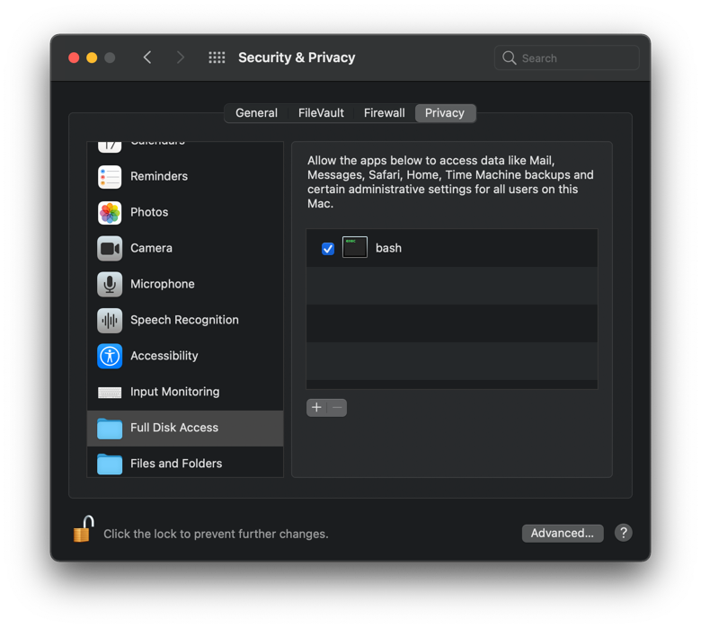

# restic-macos-scheduled-backup
macOS scheduled backup using restic


# Running a shell command after teh user logs in
```xml
<?xml version="1.0" encoding="UTF-8"?>
<!DOCTYPE plist PUBLIC "-//Apple//DTD PLIST 1.0//EN" "http://www.apple.com/DTDs/PropertyList-1.0.dtd">
<plist version="1.0">
    <dict>
        <key>Label</key>
        <string>com.example.app</string>
        <key>Program</key>
        <string>/absolute_path_to_script/hello.sh</string>
        <key>RunAtLoad</key>
        <true/>
        <key>StandardOutPath</key>
        <string>/absolute_path_to_logs/out.log</string>
        <key>StandardErrorPath</key>
        <string>/absolute_path_to_logs/out.error.log</string>
    </dict>
</plist>
```

We need to run the script on behalf of the logged in user in order to send notifications to Notification center, so we
need to [add the job to the user agents](https://www.launchd.info/): `~/Library/LaunchAgents`

## Give bash/zsh permission to run the script
Go to `System preferences...`/`Security & Privacy`/`Privacy`/`Full Disk Access` and add bash. You can select bash from
the file picker by pressing `⇧` `⌘` `G` and by typing `/bin` and selecting `bash`.
